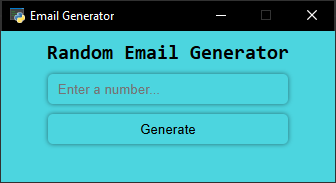

# Email Generator

A simple desktop application to generate random Gmail addresses and passwords, built with Python and [pywebview](https://pywebview.flowrl.com/) for the GUI and HTML/CSS for the frontend.

## Features
- Generate any number of random Gmail addresses and passwords.
- User-friendly GUI with a modern look.
- Each generated email/password pair is saved in a separate text file in the `GENERATED_EMAILS` folder.
- Cross-platform (Windows, macOS, Linux) as long as Python and pywebview are supported.

## Preview


## How It Works
- The app uses Python's `secrets` module to generate secure random hex strings for email and password.
- The frontend (HTML/CSS/JS) is loaded in a pywebview window.
- When the user enters a number and clicks "Generate", the app creates that many email/password pairs and saves them as `Gmail_1.txt`, `Gmail_2.txt`, etc.

## Usage
1. **Install dependencies:**
   - Install Python 3.x
   - Install pywebview:  
     ```bash
     pip install pywebview
     ```
2. **Run the app:**
   - Open a terminal in the `Email_Generator` directory.
   - Run:
     ```bash
     python email_generater.py
     ```
3. **Generate emails:**
   - Enter the number of emails you want to generate in the GUI and click "Generate".
   - The generated emails and passwords will be saved in the `GENERATED_EMAILS` folder.

## File Structure
```
Email_Generator/
├── email_generater.py      # Main Python 
├── src/
│   └── index.html         # Frontend (HTML/CSS/JS)
├── GENERATED_EMAILS/      # Output folder for generated emails (created at runtime)
```

## Customization
- You can change the email domain or password format by editing `email_generater.py`.
- The GUI can be customized by editing `src/index.html`.

## License

This project is licensed under the MIT License.